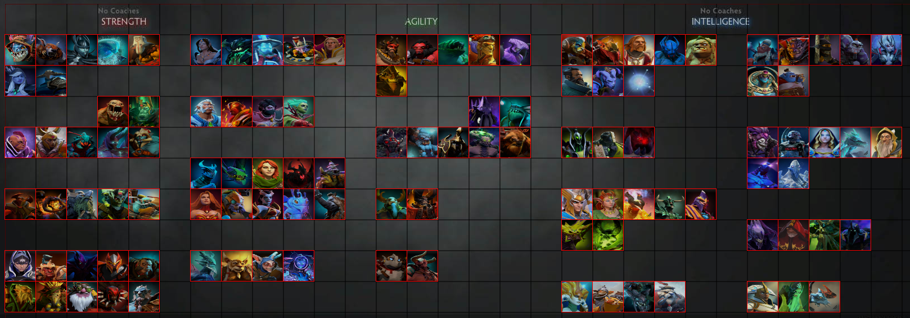

1. Déposer le fichier [fulldeck_layout.txt](/julienjoannic/dota/raw/master/fulldeck_layout.txt) dans le répertoire \dota 2 beta\dota\cfg\layouts
2. Lors de la sélection du héros en début de partie, basculer en mode "Grille"
3. Activer le mode "édition" et importer le fichier

